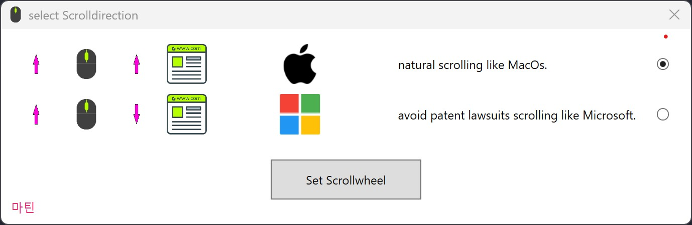

# 🖱️ SwapMouseWheel – Scrollrichtung umkehren mit Stil 🎨

Ein elegantes PowerShell-GUI-Tool, um die **Scrollrichtung von HID-Mäusen unter Windows** umzuschalten – im Stil von macOS, aber mit Windows-WPF und Liebe zum Detail.  
✔️ Kein Neustart nötig – einfach klicken und losscrollen!

---

## ✨ Features

- 🪟 **Moderne WPF-Oberfläche** im Stil von Windows 11  
- 🔃 Umschalten der Scrollrichtung per Knopfdruck  
- 🛠️ Direkter Zugriff auf die Registry (`FlipFlopWheel`)  
- ☑️ Radiobutton-Auswahl für gezielte Steuerung  
- 🌍 Mehrsprachigkeit vorbereitet  
- 🧼 Kein PowerShell-Fenster sichtbar (versteckter Start)  
- 🔒 Self-Elevating: Administratorrechte automatisch angefordert  

---

## 📷 Screenshot



---

## 🚀 Installation

1. 🔽 **Repository klonen**  
   ```bash
   git clone https://github.com/m-reisner/SwapMouseWheel.git
   cd SwapMouseWheel
   ```

2. ▶️ **Starten (als Admin empfohlen)**  
   ```powershell
   .\Start.ps1
   ```

   *(Das Script erkennt fehlende Rechte und startet sich selbst erhöht.)*

---

## 🧠 Funktionsweise

🔍 Das Tool durchsucht die Registry nach HID-Mäusen unter  
`HKLM\SYSTEM\CurrentControlSet\Enum\HID\*\*\Device Parameters`  
und setzt den Wert `FlipFlopWheel` je nach Auswahl um.

> Änderungen werden direkt übernommen, ggf. kurz USB neu einstecken.

---

## 🔐 Hinweise

- Dieses Tool **greift auf geschützte Registrybereiche zu** → Adminrechte erforderlich  
- Funktioniert nur mit echten **HID-Mäusen**, nicht mit Touchpads oder Logitech-Treibern mit Spezialsoftware  

---

## 🛠️ Entwicklung

- 💻 PowerShell 7.4+
- 🧩 WPF (XAML)
- 📁 Start via `Start.ps1` – versteckt PowerShell-Fenster und lädt GUI

---

## 🌐 Roadmap

- [ ] Multi-Language Support (z. B. 🇩🇪 / 🇬🇧)  
- [ ] Auswahl einzelner Mäuse  
- [ ] Portable `.exe`-Version mit PS2EXE oder .NET-Wrapper  

---

## 📄 Lizenz

[MIT License](LICENSE)

---

## 🤝 Mitmachen

Pull Requests, Feedback und Ideen sind herzlich willkommen!  
📫 Melde dich gerne bei Fragen oder Vorschlägen.

---

> Erstellt mit ❤️ von [m-reisner](https://github.com/m-reisner)
